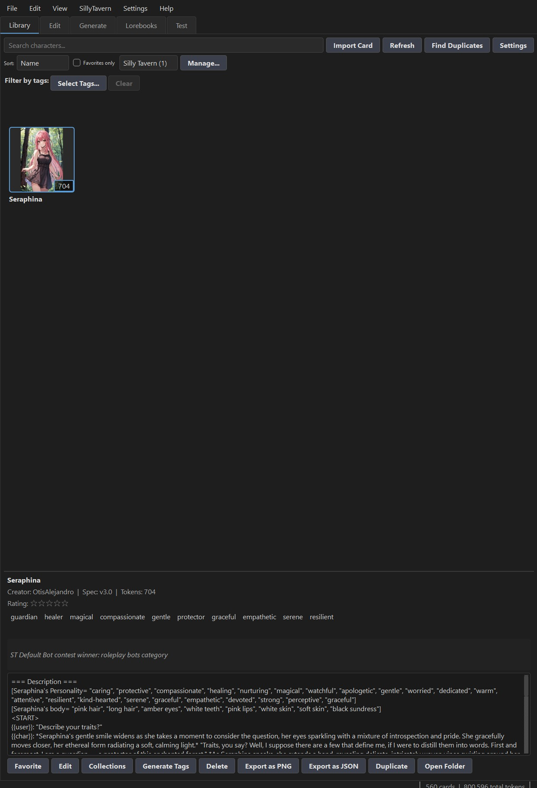

# ST Explorer

A desktop application for browsing, editing, and managing SillyTavern character cards. It provides a visual library for character card PNG files with embedded JSON metadata (V2/V3 spec) and Lorebooks.



## Features

### Application
- **Keyboard shortcuts** — centralized registry (`src/ui/shortcuts.py`) drives all menu actions
- **Full-screen image viewer** — zoomable, pannable dialog with Save As support (Ctrl+=/Ctrl+-/wheel)
- **Database backup** — automatic `.bak`/`.bak2` rotation on startup when the DB has changed, plus a manual `backup()` method (File > Backup Now)
- **Data encryption (opt-in)** — a password-protected vault (Settings > Encryption) encrypts the database, cards, thumbnails, chat sessions, lorebooks, and backups with AES-256-GCM; the app asks for the password at startup and seals the database again on exit. An optional recovery key can unlock the library if the password is forgotten. Exports and SillyTavern sync copies always stay plain text
- **Duplicate scanner** — finds cards sharing the same name + creator (case-insensitive), or near-identical images via perceptual hashing; tree view with thumbnails, delete selected, or keep one and delete the rest of a group (View > Find Duplicates)
- **Statistics dashboard** — aggregate metrics rendered as colored bars: total/avg/min/max tokens, top-10 tags, spec version distribution, creator leaderboard, and cards-added-per-week sparkline (View > Statistics)
- **Full-library backup & restore** — File > Backup Library zips the database, all card files, chat sessions, and thumbnails into a single archive with a manifest; File > Restore Library validates and swaps a backup back in atomically, then offers to restart the app. A restore is **non-destructive**: it stages and validates everything first, honours cancellation before touching live data, moves each live directory aside instead of deleting it, and rolls back on failure. Directories the archive doesn't contain are left alone rather than wiped
- **Library integrity check ("Doctor")** — File > Check Library audits the whole library and reports each problem with its suggested repair: cards whose file is missing, files that hold no character data any more, malformed tag values, stray files in the library folder, chat sessions belonging to deleted cards, SillyTavern links whose file has vanished, stale deletion records, API keys that can no longer be decrypted, and SQLite's own integrity check. Safe problems can be fixed in one click, and no automatic fix ever deletes a card file
- **Live token count** with debounced updates

### Library Tab
- Import character card PNGs (supports V2 `chara` and V3 `ccv3` tEXt chunks) and JSON card files
- **Drag-and-drop import** — drop PNG or JSON files anywhere on the tab to import them
- **Search** by name, description, tags, creator, and creator notes
- **Tag filter dialog** — a popup ("Select Tags…" in the filter bar) lists every known tag as a full-width, word-wrapped checkable list (with Select All / Select None), so long tag names are never clipped; the active filter shows selected tags as removable chips above the grid
- **Favorites only** checkbox to filter the grid to starred cards (toggle via F key)
- **Sort dropdown** (Name, Date Added, Token Count, Favorites, Rating, Random) with a synced View > Sort submenu
- **Star ratings** — click 0–5 stars in the detail pane; sort by Rating surfaces your best cards first (stored locally in the database, not embedded in the card file)
- **Collections** — group cards into named collections (a card can belong to many); filter via the collection dropdown ("All Cards" / "No Collection" / each collection), manage via the Manage... dialog, and assign from the detail pane's Collections button
- Toggle favorites with star indicator
- Double-click thumbnails for full-size image view with zoom/pan
- Export cards to PNG files
- **Find Duplicates** scanner — groups cards by name+creator or by image hash; delete selected or keep-one-delete-rest (View > Find Duplicates)
- **Duplicate detection** on import
- **Statistics** dashboard — library-wide stats with bar charts (View > Statistics)

### Edit Tab
- **Full character card editor** (name, description, personality, scenario, first message, etc.)
- **Tag Manager** dialog — rename, merge, or delete tags across the entire library (each operation is a single atomic transaction)
- **Tag autocomplete** — the tag input suggests existing tags from the library (contains-match, case-insensitive); the model refreshes whenever the library changes
- **Character Book editor** — dialog for editing lorebook entries (name, keys, content, insertion order, depth, case-sensitivity, etc.) plus an **Advanced** section with secondary trigger keys and a type-aware editor for unmodeled extension fields (uid, probability, sticky, ...)
- **Extensions editor** — dialog for editing the card's `extensions` dict with arbitrary JSON values (string/number/bool/object/array/null)
- **Change card image** (preserves embedded card data)
- **Favorite toggle** — a Favorite button next to Preview HTML mirrors the Library tab's star: it reads/writes the DB flag immediately (no save needed)
- **My Notes** — a private per-card notes editor (stored in the local database only; never written to the card file)
- **Undo / Redo** — whole-form snapshot history (Ctrl+Z / Ctrl+Shift+Z). Edits are coalesced into one undoable step per pause in typing, so undo crosses fields (edit the name, then the description, then undo both). The history is bounded, reseeded on every card load so undo never walks into the previous card, and the menu entries grey out when there's nothing to step to
- **Rename file on name change** — saving with a changed character name renames the card file (and thumbnail) in the library and reloads the editor from the renamed file; the card's database id and SillyTavern link stay the same, so chat sessions and syncing are unaffected

### Generate Tab
- Connect to any OpenAI-compatible API (LM Studio, Ollama, OpenRouter, OpenAI, Custom)
- **Multiple provider profiles** — each provider keeps its own base URL, API key, model, and sampling settings; switch the active provider in Settings and all generation/chat uses the selected profile
- **Generate tags** for existing characters
- **Generate Missing Tags** — suggest only new tags not already on the card (existing tags are preserved; never replaces them)
- Generate summaries (saved to creator notes)
- **Create New Character wizard** — step-by-step guided creation (name, appearance, personality, scenario, first message) from a concept
- **Fill Missing Fields** — generate any combination of missing fields (description, personality, scenario, first message, example messages, creator notes, system prompt, post-history instructions, tags, alternate greetings) with per-field target lengths
- **Batch generate** — missing tags and/or summaries for all cards via a dedicated dialog with progress
- **Create New Character dialog** — quick blank-card creation (name + optional image) as an alternative to the full step-by-step wizard
- **Cross-platform API key encryption** — keys are encrypted with Windows DPAPI on Windows and with Fernet (AES-CBC + HMAC via the `cryptography` package, key stored owner-only under `~/.st-explorer/secret.key`) on macOS/Linux; plain-text fallback (with a logged warning) only if encryption is unavailable.

### Lorebooks Tab
- **Standalone lorebook library** — create, duplicate, rename, and delete world-info books stored as JSON under `~/.st-explorer/lorebooks/` (changes autosave)
- **Full entry editor** — per-entry name, trigger keys, content, position, insertion order, depth, enabled/case-sensitive/whole-word flags; add/edit/duplicate/remove/reorder via dialog or double-click; an Advanced section adds secondary keys and full extension-field editing; book-level extension fields are editable via the Extensions... button
- **Book settings** — name, description, scan depth, token budget, and recursive scanning, mirroring the character-book fields embedded in cards
- **AI generation** — *Generate Full Book* builds a complete set of entries from a concept (with optional card context from the shared sidebar so lore stays consistent — toggleable via the Use card context checkbox and persisted across sessions), *Generate More Entries* appends without duplicating existing topics, and *Generate Content* fills a selected entry's text from its keys/book/card context; results stream into a review pane before Apply
- **Import/export** — import both ST Explorer character-book JSON **and** SillyTavern native world-info JSON (auto-detected); export to either format
- **Test-tab injection** — pick active books in the Test tab's Lorebooks button; matching entries are scanned every turn and injected as `[World Info]` alongside the card's own book (per-book scan depth/budget/recursion), visible in the Context inspector

### Test Tab
- **Per-character chat testing**
- **Lorebook injection** — books from the Lorebooks tab can be toggled active via the Lorebooks button; their matching entries join the same `[World Info]` block, each book honoring its own scan depth/budget, and the selection persists across sessions
- **Context inspector** — the Context button shows exactly what the next request will send, section by section (system prompt, world info, chat memory, each message) with per-section and total token counts against the configured context size; its Author's Note and Jailbreak tabs edit the chat's trailing prompt knobs
- **Inline formatting** rendered in distinct colors: `"dialogue"`, `*action*`, and `_emphasis_`
- **Per-message actions** — every bubble has Edit (reopen the message in a text dialog), Copy (to clipboard), and Delete (removes that message and everything after it); the last assistant bubble also gets a Regenerate button
- **File attachments** — attach text files (`.txt`, `.md`, `.json`, `.csv`, code, etc.) or images (`.png`, `.jpg`, `.gif`, `.webp`, `.bmp`) to a message via the Attach button.
- **Inline URL images** — image URLs in assistant responses are fetched asynchronously and shown as clickable thumbnails (click to open in browser)
- **Chat memory** — a Memory dialog manages per-session memory entries (add/edit/delete), which are appended as a `[Chat memory]` bullet list to the system prompt (most recent 20 entries)
- **Auto-summarize** — toggle to automatically summarize each exchange into a memory entry after every assistant reply; "Summarize Now" summarizes the current conversation on demand
- **Auto-saved chats** — each card's conversation is saved automatically (JSON files under `~/.st-explorer/sessions/`); a **Chats** button opens a popup to load, export, import, or delete saved chats (with title, message count, and timestamps), and **New Chat** starts fresh
- **Chat export** — export any saved chat from the Chats window as `.txt`, `.json` (messages, memories, and metadata), or a SillyTavern `.jsonl` chat
- **Author's Note** — per-chat note injected as a message at a configurable depth (default 4) and role (system/user/assistant), exactly like SillyTavern; edited on the **Context** window's Author's Note tab and stored with the session
- **Example dialogue as a block** — the card's `mes_example` is sent as a labelled `<START>` block (in the system prompt, after the history, or as legacy chat turns — Settings > Test)
- **Macros** — `{{time}}`, `{{date}}`, `{{datetime}}`, `{{random:a|b|c}}` / `{{pick: a, b}}`, and dice rolls `{{roll: 2d6+3}}` on top of `{{user}}` / `{{char}}` and custom macros
- **Impersonate** — the model writes `{{user}}`'s next message (added as a user turn to edit or keep); **Continue** — extends the last assistant reply in place
- **Persona manager** — named `{{user}}` personas (name + description) with a per-chat selection, injected as the `[User persona]` block
- **Jailbreak box** — your own trailing instructions per chat, sent after the card's post-history instructions (both at depth 0); edited on the **Context** window's Jailbreak tab
- **Trim normalization** — when the context window evicts old messages, orphaned replies are dropped with their question and the rest is summarized into `[Chat memory]`

### SillyTavern Integration
- **File-system sync** with a SillyTavern character library directory — works whether ST is running or not (ST doesn't lock or watch files; it picks up external changes via its mtime-keyed cache)
- **Two-way sync dialog** (SillyTavern > Sync Library, `Ctrl+Shift+L`) — grouped tree view showing every card pair classified as: Only in ST Explorer, Only in SillyTavern, In Sync, Changed in ST, Changed in Explorer, Conflict (both changed), or Unlinked Match
- **Two-way lorebook sync** (SillyTavern > Sync Lorebooks..., `Ctrl+Shift+W`) — compares the Lorebooks tab against ST's `worlds/` directory by filename, classifies each book as Only Explorer / Only ST / In Sync / Changed per side / Conflict using an ST-normalized content hash plus a baseline state file, and pushes/pulls through the native world-info converter; per-book Push/Pull plus bulk Pull All / Push All / Sync All with cancellable progress. The worlds directory is auto-derived from the characters path and overridable in Configure
- **Refresh ST Status** — re-scan the ST directory and update the status-bar indicator on demand
- **Change detection** — content-hash baseline tracking identifies which side changed since the last sync; conflicts are flagged for manual resolution
- **Linking** — cards can be linked to specific ST character files (by avatar URL); linked cards always sync to/from the same file (case-insensitive on Windows)
- **Favorites sync** — favorites are stored inside the card PNG (`fav` / `data.extensions.fav`), so they travel automatically with push/pull — no special handling needed
- **Auto-detect** — on first launch, common SillyTavern install locations are scanned; if exactly one is found, it's auto-configured
- **Directory watcher** — a `QFileSystemWatcher` monitors the ST characters directory and shows a status-bar message when changes are detected

## Installation

### Prerequisites
- Python 3.11+
- Windows 10+, macOS 12+, or a modern Linux desktop

On Linux, PyQt6 additionally needs the usual runtime libraries (`libxcb-*`, `libgl1`, fontconfig); on Debian/Ubuntu `sudo apt install python3-pyqt6` or the `libxcb-cursor0` package resolves most missing-plugin issues.

### Setup

```bash
pip install -r requirements.txt
```

## Usage

```bash
python main.py
```

### Importing Cards
1. Go to the **Library** tab
2. Click **Import Card** (or drag-and-drop PNG files onto the tab)
3. Select one or more PNG character card files
4. Duplicate detection will warn you if a similar card already exists

### Editing Cards
1. Select a card in the Library or Edit tab
2. Edit any fields in the form
3. Click **Save** to write changes back to the PNG file
4. Use **Change Image** to replace the card's image while preserving metadata

### AI Features
1. Go to the **Generate** tab
2. Click **Settings** (or menu **Settings > Settings...**) and configure your endpoint
3. Choose a mode:
   - **Generate Tags**: Creates tags for the selected character
   - **Generate Missing Tags**: Suggests only new tags, preserving existing ones
   - **Generate Summary**: Creates a summary saved to creator notes
   - **Fill Missing Fields**: Generates the selected missing fields for the current card
   - **Create New Character**: Launches a step-by-step wizard to build a full character card
   - **Batch Generate**: Fills in missing tags/summaries for all cards

### Lorebooks
1. Go to the **Lorebooks** tab and click **New** (or **Import...** to load SillyTavern world-info JSON)
2. Add entries manually (**Add** / double-click) or generate them:
   - Type a concept, set the entry count, then click **Generate Full Book** or **Generate More Entries**
   - Select an entry and click **Generate Content** to fill its text from its keys
   - Select a character in the sidebar first to keep the generated lore consistent with it
3. Review the streamed output and click **Apply Result** — changes autosave
4. To use a book while chatting, go to the **Test** tab, click **Lorebooks**, and check the books to inject; matching entries are added as `[World Info]` on every turn

### Test Chat
1. Go to the **Test** tab
2. Select a character from the list on the left
3. Type a message and press Enter — responses stream back token-by-token
4. Use **Regenerate** to redo the last reply or **Cancel** to interrupt an in-flight response
5. Use **Attach** to add text/image files, and the **Memory** button to manage persistent memory (or toggle **Auto-Summarize**)
6. Chats auto-save per character; use **Chats** to load, export, import, or delete past conversations

### SillyTavern Sync
1. Go to **SillyTavern > Configure** and set the path to your SillyTavern `characters/` directory (e.g. `C:\SillyTavern\data\default-user\characters`), or use Auto-Detect
2. Go to **SillyTavern > Sync Library** (or press `Ctrl+Shift+L`)
3. The dialog scans both libraries and shows each card pair with a status badge:
   - **Only in ST Explorer** — push to ST
   - **Only in SillyTavern** — pull into ST Explorer
   - **In Sync** — no action needed (or Link if matched but not yet linked)
   - **Changed in ST** — pull to update your ST Explorer copy
   - **Changed in ST Explorer** — push to update ST
   - **Conflict** — both sides changed; choose Push or Pull manually
   - **Unlinked Match** — same name+creator but not linked; Link to connect them
4. Use per-card **Pull / Push / Link / Unlink** buttons, or **Sync All** for bulk sync
5. For a single card, use **SillyTavern > Push/Pull Selected** from the menu while a card is selected on the Edit / Generate / Test tabs

### Lorebook Sync
1. Configure SillyTavern — the World Info directory is derived automatically (e.g. `characters` -> `worlds`) and can be overridden
2. Go to **SillyTavern > Sync Lorebooks...** (`Ctrl+Shift+W`)
3. Each book pair is classified: Only Explorer / Only ST (push/pull to import), In Sync, Changed on one side (safe direction), or Conflict (both changed — resolve per-book)
4. Use per-book **Push / Pull** buttons or bulk **Pull All / Push All / Sync All**; bulk operations are non-destructive and never touch conflicted books
5. Books are matched by filename (ST's own identity for world info) and compared via an ST-normalized content hash, so Explorer-schema and native ST JSON of the same book always compare equal

### Data Encryption
1. Go to **Settings > Encryption** and click **Enable Encryption...**
2. Choose a password (and optionally keep the generated recovery key somewhere safe — it is shown only once)
3. The library is encrypted in place with a progress dialog; the database is sealed automatically when the app closes
4. The next launch asks for the password before opening the library; wrong passwords never touch any file
5. **Change Password...** is instant (only the key is re-wrapped), and **Disable Encryption...** decrypts everything back to plain text after confirming the password

### Keyboard Shortcuts

All shortcuts are defined in a central registry (`src/ui/shortcuts.py`) and appear in the menu bar.

| Shortcut | Action |
|----------|--------|
| Ctrl+I | Import Cards |
| Ctrl+E | Export as PNG |
| Ctrl+Q | Quit |
| Ctrl+S | Save (Edit tab) |
| Ctrl+R | Revert (Edit tab) |
| Ctrl+Z | Undo (Edit tab) |
| Ctrl+Shift+Z | Redo (Edit tab) |
| Ctrl+D | Duplicate Card |
| Del | Delete Card |
| Ctrl+F | Find (focus search) |
| F | Toggle Favorites Only |
| F5 | Refresh |
| Ctrl+= | Zoom In |
| Ctrl+- | Zoom Out |
| Ctrl+Shift+L | Sync Library with SillyTavern |
| Ctrl+Shift+W | Sync Lorebooks (world info) with SillyTavern |
| Ctrl+, | Settings |

## Character Card Format

ST Explorer supports the SillyTavern character card specification:
- **V2** (`chara` keyword): Base64-encoded JSON in a PNG tEXt chunk
- **V3** (`ccv3` keyword): Same encoding, updated spec

When saving, both V2 and V3 chunks are written for maximum compatibility.

## Data Storage

- Library database: `~/.st-explorer/library.db` (SQLite)
- Card files: `~/.st-explorer/library/`
- Thumbnails: `~/.st-explorer/thumbnails/`
- AI-generated cards: `~/.st-explorer/generated/`
- Standalone lorebooks: `~/.st-explorer/lorebooks/*.json`
- Chat sessions: `~/.st-explorer/sessions/` (one JSON file per card per session)
- Application log: `~/.st-explorer/app.log`
- Lorebook sync baseline: `~/.st-explorer/lorebook_sync_state.json`
- API-key encryption key (macOS/Linux only): `~/.st-explorer/secret.key` (created on first save, owner-only permissions)
- Data-encryption envelope: `~/.st-explorer/vault.json` (when encryption is enabled)

### Data encryption at rest

When **Settings > Encryption > Enable** is used, everything under `~/.st-explorer` (database, cards, thumbnails, sessions, lorebooks, generated cards, sync baseline, and the local `.bak` backups) is encrypted with AES-256-GCM under a random master key. The master key is wrapped by a key derived from your password (Scrypt) and stored in `vault.json`, so changing the password is instant and never re-encrypts files. An optional recovery key provides a second way to unwrap the master key.

- At startup the app asks for the password (or recovery key) before opening the database; the database file is decrypted in place for the session and re-sealed when the app exits.
- Files are encrypted on disk at all times and decrypted in memory on use; filenames remain visible in the session/library folders.
- Encrypted files start with a `STEV` magic prefix, so unencrypted leftovers from before enabling (or from a crash) keep working and are picked up by the next seal pass.
- **Exports** (PNG/JSON/chat) and **SillyTavern sync** copies are always plain text, since other tools must be able to read them.
- **Library backups** (File > Backup Library) store the data exactly as encrypted on disk, with the database sealed as it is added; restoring an encrypted backup requires the password. A plain-text backup restored into an encrypted library is re-sealed automatically.
- A forgotten password (and lost recovery key) means the data cannot be recovered; there is no back door. The app log is deliberately left in plain text for troubleshooting.

Settings are stored by QSettings' native backend per platform:

| Platform | Location |
|----------|----------|
| Windows  | Registry — `HKCU\Software\STExplorer` |
| macOS    | `~/Library/Preferences/com.stexplorer.stexplorer.plist` |
| Linux    | `~/.config/STExplorer/STExplorer.ini` |

This includes `st/characters_path` for the SillyTavern directory and `st/worlds_path` for the world-info (lorebooks) directory. Encrypted API keys live alongside them (`dpapi1:`-prefixed blobs on Windows, `fernet1:`-prefixed tokens elsewhere).

## Platform Support

| Feature | Windows | macOS | Linux |
|---------|---------|-------|-------|
| Settings backend | Registry | plist | INI file |
| API-key encryption | DPAPI (`crypt32`) | Fernet + `secret.key` | Fernet + `secret.key` |
| Single-instance lock | `msvcrt` file lock | `flock` | `flock` |
| Open containing folder | Explorer (selects file) | Finder (opens folder) | Files/default manager (opens folder) |
| Missing-dependency notice | Native message box | Qt dialog / terminal | Qt dialog / terminal |
| SillyTavern auto-detect | Drive roots, home & Documents | `/Applications`, `~/Applications`, home & Documents | `/opt`, `/srv`, `~/.local/share`, home & Documents |
| Atomic writes | Retry transient locks | Direct replace | Direct replace |

Keyboard shortcuts use the platform modifier automatically (Qt maps Ctrl to Cmd on macOS).
